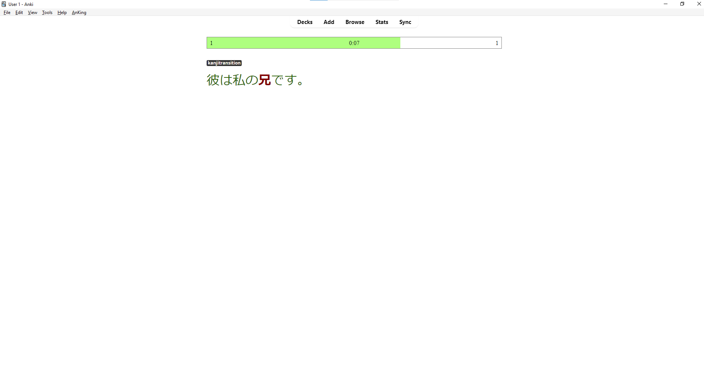

# Counter Bar

This add-on adds a top bar to the review screen with the following elements:

-   A repeating countdown timer with configurable time in the middle.
-   A counter on the left that starts from 0 and behaves like this:
    -   The counter goes up by 1 when you rate a card, suspend it, bury it or delete it.
    -   If the countdown timer ends and the counter is <= 0, the counter goes down by 1. If it's > 0, it resets to 0.
-   A counter on the right for the number of countdown loops passed in the current review session.
-   A progress bar indicating the countdown time. The bar will be red if the left-side counter is <= 0, green otherwise.

## Changelog

See [CHANGELOG.md](CHANGELOG.md) for a list of changes.

## Support & feature requests

Please post any questions, bug reports, or feature requests in the [support page](https://forums.ankiweb.net/c/add-ons/11) or the [issue tracker](https://github.com/abdnh/anki-addon-template/issues).

If you want priority support for your feature/help request, I'm available for hire.
You can get in touch from the aforementioned pages, via [email](mailto:abdo@abdnh.net) or on [Fiverr](https://www.fiverr.com/abd_nh).

## Support me

Consider supporting me if you like my work:

I'm also available for freelance add-on development on Fiverr:

